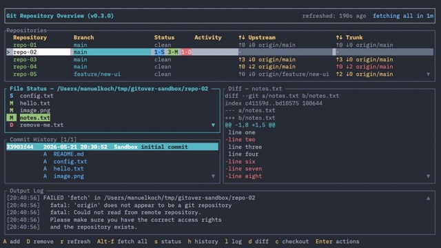

# Gitover

A terminal UI for monitoring multiple git repositories simultaneously.

See [features](docs/features.md) for the full feature reference.

## Features (brief)

- Live status for all tracked repos in a single table
  - current branch, ahead/behind upstream and trunk
  - change counter: staged / conflict / modified / deleted / untracked
- Background git operations: fetch, pull, push, force-push, checkout, create & delete branch, commit & amend commit, undo commit
- Fetch all repos in parallel (`Alt-f`)
- Status Details pane — per-file change list with priority sorting and scroll indicators
- Commit History pane — full log or filtered ahead/behind upstream & trunk; file sub-rows per commit; `,`/`.` jump between commits
- Details pane — diff of selected file, or full commit details (hash, author, change summary, word-wrapped message) with position indicator
- Output Log pane — timestamped, severity-coloured git command output with auto-follow
- Per-file actions: stage, unstage, revert, discard, commit, amend commit
- Branches pane — full list of local and remote-only branches with ahead/behind counts; direct checkout and branch action menu
- Help overlay (`?`) — Show available keybindings
- Automatic release version check (configurable, with popup + header indicator)
- Custom repo commands configurable per project
- File-system watcher for instant refresh (no polling)
- Persistent repo list and pane state across sessions



## Build & Install

Requirements:
- Rust toolchain
- cmake + a C compiler (Xcode Command Line Tools) — vendored libgit2
- perl + make — vendored OpenSSL

```shell
git clone <repo-url>
cd gitover-rust-tui
cargo build --release
```

Build and install in one step:

```shell
make install
```

Or install directly from the remote git repo:

```shell
cargo install --git https://github.com/manuel-koch/gitover-rust-tui
```

## Configuration

See [Configuration](docs/configuration.md) for full description.

Config file lookup: searches for `gitover.config.yaml` starting from the current working directory,
walking up to the filesystem root; falls back to `~/.config/gitover/config.yaml`.
A missing file is valid — defaults are used.

```yaml
general:
  git: /usr/local/bin/git              # optional: override git executable path
  auto_fetch_interval: 600             # seconds between background fetches (0 = disabled)
  debug_log: ~/logs/gitover.log        # optional: persistent debug log (supports ~ and ${VAR})
  case_sensitive_path_sorting: false   # optional: true = case-sensitive path sort (default: false)
  release_check_interval: 86400        # optional: seconds between release version checks (0 = disabled, default: 86400)

repo_commands:
  - name: Open in editor
    cmd: code ${ROOT}             # ${ROOT} and ${BRANCH} are repo vars; ${HOME} etc. are env vars
    background: true
```

State (repo list, pane visibility) is saved automatically to `~/.config/gitover/state.yaml`
(or a `gitover.state.yaml` found by the same CWD-walk).

## Usage

```shell
gitover [--config <path>] [--state <path>] [--debug-log <path>]
```

See [CLI options/flags](docs/configuration.md#cli-optionsflags),
[Debug Logging](docs/features.md#debug-logging),
and [Custom Repo Commands](docs/features.md#custom-repo-commands).

On first launch the repo list is empty. Press `A` to add a repository using the file picker.
If the current working directory is a git repository it is added automatically.

## Keybindings

See [Navigation Keyboard](./docs/keybindings.md).
