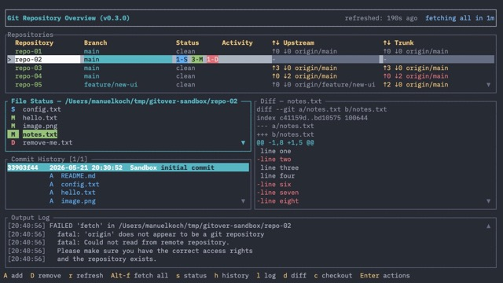

# Gitover TUI Features

## General

- Rust-based terminal UI application
- Tracks multiple git repositories simultaneously



## CLI options/flags

| Flag | Description |
|------|-------------|
| `--version` | Show version & built info and exit |
| `--config <path>` | Override the config file location (skips CWD-walk and global fallback) |
| `--state <path>` | Override the state file location (skips CWD-walk and global fallback); file is created on first save if absent |
| `--debug-log <path>` | Enable debug logging to a file; path supports `~` and `${VAR}` expansion. Appended to if it already exists, created otherwise. Overrides `general.debug_log` from config. App terminates if any variable cannot be resolved |

## Configuration

- Config file lookup: searches for `gitover.config.yaml` starting from the current working directory
  and walking up to the filesystem root; falls back to `~/.config/gitover/config.yaml` if not found.
  Missing file is valid — default config is used.
- `general.git`: override the path to the git executable
- `general.auto_fetch_interval`: interval in seconds for automatic background fetch of all repos
  (default: 600 = 10 minutes; set to 0 to disable automatic fetch)
- `general.debug_log`: path to the debug log file; supports `~` and `${VAR}` expansion. Appended to if
  it already exists, created otherwise. Can be overridden by `--debug-log` CLI flag. App terminates if
  any variable cannot be resolved
- `repo_commands`: list of commands that can be run for current repository
  - `repo_commands[].name`: Description of the command, will be shown in action menu
  - `repo_commands[].cmd`: The command line to be executed; supports `${VAR}` substitution in two steps:
    1. Repo-dependent variables: `${ROOT}` (git root path), `${BRANCH}` (current branch name)
    2. Environment variables: any `${VAR}` still unresolved is looked up in the process environment
    The command is not executed if any variable cannot be resolved
  - `repo_commands[].background`: Boolean flag whether the `cmd` should be executed in background
- Persisted app state (repo list, pane visibility):
  - State file lookup: searches for `gitover.state.yaml` starting from CWD and walking up to root;
    falls back to `~/.config/gitover/state.yaml` if not found.
  - Relative paths in the state file are resolved against the directory containing the state file.
  - When saving, repo paths that are under the state file's directory are stored as relative paths,
    keeping per-project state files portable.

## Repository Management

- Add a repository with `A`; opens a directory-browser starting at the current working directory
  - `↑`/`↓` navigate the directory list
  - `→` / `Enter` navigates into the selected directory
  - `←` / `Backspace` goes to the parent directory
  - `Space` confirms the current directory as the repo to add — this allows adding a
    child repo even when its parent directory is itself a git repo
  - Hint bar at the bottom of the picker progressively hides navigation groups when the
    terminal is too narrow, always keeping the `Space` / `Esc` hints visible
  - Auto-discovers and adds git submodules when a repo is added
  - Newly added repo is immediately selected in the Repositories pane
- Remove a repository from the app ( not from disk ! ) with `D`; shows a confirmation dialog before removing
- Repo list is kept sorted by absolute path
- Repo list is persisted across sessions
- On first launch with an empty state file, the current working directory is automatically
  added as a tracked repo if it is a git repository
- Invalid or missing repo paths are shown as error rows: repo name in the first column,
  full error message spanning all remaining columns

## Repository Table

Each tracked repository is shown as a table row with:

- **Repository**: directory name, green when working tree is clean
- **Branch**: current branch name, or `detached <sha8>` for detached HEAD; unborn
  branches (no commits yet) show the branch name correctly
- **Status**: combined change counts
  - `3-S 2-C 4-M 1-D 2-U` (S=staged blue, C=conflict yellow, M=modified green, D=deleted red, U=untracked gray)
  - Shows `clean` in dark gray when no changes
- **Activity**: spinner + operation name when a git operation is in progress (fetching / pulling / pushing / rebasing / scanning)
- **↑↓ Upstream**: ahead/behind vs configured tracking branch, yellow when out of sync
- **↑↓ Trunk**: ahead/behind vs trunk branch, red when behind, yellow when ahead only
  - Trunk resolution order:
    - git config `gitover.trunkbranch`
    - `origin/main`
    - `origin/develop`
    - `origin/master`
- Column widths are distributed so branch/upstream/trunk columns are wider than status
- Scroll indicators (▲ / ▼) appear at the top-right / bottom-right of the table when the
  repo list overflows the visible area

## Git Operations

Pressing `Enter` on a selected repository opens the per-repo action menu. The menu
lists all available actions with their shortcut key. Dismiss with `Esc`.

| Key (in menu) | Action |
|---------------|--------|
| `f` | Fetch — runs `git fetch origin --prune`; triggers a status refresh on completion |
| `p` | Pull — runs `git pull --prune`; auto-stashes dirty changes before pull, pops stash afterwards |
| `P` | Push — pushes current branch; automatically sets upstream (`--set-upstream origin HEAD`) if not configured |
| `F` | Force Push — pushes with `--force --set-upstream origin HEAD` (confirmation dialog shown first) |
| `c` | Checkout Branch — shows a list of local and remote branches; auto-stashes dirty changes before checkout, pops stash afterwards |
| `n` | Create New Branch — prompts for a branch name (input is sanitised), runs `git checkout -b <name>` |
| `h` | Commit History — opens the history pane for the selected repo (full log) |
| `u` / `U` | Commit History ahead of / behind upstream (only shown when upstream is configured) |
| `t` / `T` | Commit History ahead of / behind trunk (only shown when trunk branch is resolvable) |

Direct shortcuts `f`, `p`, `P`, `c` also work from the normal Repositories view without opening the menu.

### Custom Repo Commands

Entries from `repo_commands` config are appended to the per-repo action menu below a separator line, after all built-in actions. Digit keys `1`–`9` (then `0`) are assigned in declaration order. Each command:

- Runs with the working directory set to the repo's git root
- Variable substitution uses `${VAR}` syntax only, applied in two steps:
  1. Repo variables: `${ROOT}` (git root path), `${BRANCH}` (current branch name)
  2. Environment variables: any remaining `${VAR}` references resolved from the process environment
- Command is not executed if any variable cannot be resolved; an error is logged for each unknown variable
- Appends its output to the Output Log pane on completion
- If `background: true`, is spawned without waiting and its output is discarded

`Alt-f` fetches all tracked repositories in parallel (global shortcut, works from any pane).

All git operations run in the background. Progress is shown via the Activity column spinner.
Output lines (stdout + stderr) are appended to the Output Log pane with timestamps.

## Status Details Pane

- Toggle with `s`; title shows "Status Details — <repo path>"
- Lists each changed file with a single-letter status code (C/S/M/D/U) in its status colour followed by the file path
- Files sorted by priority: Conflict → Staged → Modified → Deleted → Untracked, then alphabetically within each group
- Scrolls when file count exceeds panel height; cursor always stays visible
- Scroll indicators (▲ / ▼) appear when content overflows above or below the visible area; coloured with focused/unfocused border colour
- Tab focus moves to this pane when opened; Tab cycles back to Repositories

## Per-file Actions

Pressing `Enter` or double-clicking a file in the Status Details pane opens the per-file action menu.
Available actions depend on the file's current git status:

| File status | Actions |
|-------------|---------|
| Staged | **Unstage file** — `git reset -- <path>` |
| Modified | **Stage file** — `git add -- <path>`; **Revert file** — `git checkout -- <path>` |
| Deleted | **Stage deletion** — `git add -- <path>`; **Revert file** — `git checkout -- <path>` |
| Conflict | **Revert file** — `git reset -- <path>` followed by `git checkout -- <path>` |
| Untracked | **Stage file** — `git add -- <path>`; **Discard file** — deletes the file from disk |

Dismiss the menu with `Esc` or by clicking outside it.

## Output Log Pane

- Toggle with `l`
- Shows timestamped lines from git command output in local time; each line displays `[HH:MM:SS LEVEL] message`
- Severity is colour-coded: `INFO` default, `WARN` yellow, `ERROR` red, `DEBUG` dim gray
- Auto-follows new entries (scrolls to tail) when cursor is at the last visible line
- When pane is not focused, always shows the tail (latest entries)
- User can scroll up into history; scrolling back to tail re-enables auto-follow
- Automatically shown when a git operation fails, so error output is immediately visible
- Scroll indicators (▲ / ▼) appear when content overflows above or below the visible area
- Pressing `Enter` when the Output Log pane has focus opens the log action menu
  - Menu entry "Copy log output" copies the entire log content to system clipboard
  - After copying, shows a transient popup notification "Log output copied to clipboard!" that auto-dismisses after 2 seconds

## Debug Logging

When `--debug-log <path>` is passed on the command line, gitover writes a structured log to the specified file.

- Enabled via `--debug-log <path>` CLI flag or `general.debug_log` config option; CLI flag takes precedence
- Both path sources support `~` and `${VAR}` expansion; the app terminates with an error if any variable cannot be resolved
- File is appended to if it already exists, created otherwise; no file is written when neither source is set
- Every entry in the Output Log pane is mirrored to the debug log file
- Internal debug events (raw key events, operation dispatch) that are not shown in the UI are also written
- Each line uses the format: `[HH:MM:SS LEVEL] message`
  - `LEVEL` is right-aligned in a 5-character field: `DEBUG`, ` INFO`, ` WARN`, `ERROR`
- Severity levels:
  - `DEBUG` — internal events (key presses, operation routing); file only, not shown in the Output Log pane
  - `INFO` — normal operation output (fetch started, scan complete, etc.)
  - `WARN` — non-fatal anomalies
  - `ERROR` — failed git operations

## Git History Pane

- Toggle with `h`; also opened via action menu entries `H` / `u` / `U` / `t` / `T`
- Title shows pane name, commit position indicator, and active filter — e.g. `Commit History [3/42]` or `Commit History [3/42] (ahead of origin/main)`
- Displays commit history for the current branch, newest commit first, up to 200 commits
- Two-column table layout: short hash (8 chars, yellow) | rest of row as a single styled line
  - Rest of row: timestamp (YYYY-MM-DD HH:MM:SS local, gray) · author (cyan, up to 20 chars, padded) · commit message (first line)
- Each commit row is followed by file sub-rows aligned with the timestamp column:
  - Format: `<change-identifier>  <path>` (two spaces between code and path)
  - A = added (blue), M = modified (green), D = deleted (red), R = renamed (yellow)
- `↑`/`↓` and `PgUp`/`PgDn` scroll through commits and file rows
- `Shift-↑` / `Shift-↓` (or `,` / `.`) jump directly to the previous/next commit header row, skipping file sub-rows; `,`/`.` are provided as alternatives for terminals that intercept Shift+Arrow (e.g. Zed)
- Scroll indicators (▲ / ▼) appear when content overflows above or below the visible area; coloured with focused/unfocused border colour
- History reloads automatically when the selected repo changes while the pane is open
- History reloads automatically after a git operation completes on the shown repo
- When switching repos, if the active filter (e.g., "behind trunk") is not applicable to the new repo (no ahead/behind commits), the view automatically falls back to showing the full branch history
- Filtered views available from the action menu:
  - Ahead of upstream / trunk — commits in HEAD not yet in the remote ref
  - Behind upstream / trunk — commits in the remote ref not yet merged locally
- `h` closes the pane; `Tab` cycles focus between panes without closing it

## Details Pane

- Toggle with `d`; visibility is persisted in the state file across sessions
- Occupies the right half of the combined Status Details + History vertical area; those panes shrink to the left half when the Details pane is open
- Three display modes selected automatically based on what is focused/selected:
  - **Diff mode** — title `Diff — <filename>`; shows a patch diff for the selected file
  - **Commit mode** — title `Commit [n/m]`; shows full commit details for the selected commit header row
  - **Empty mode** — shows `Select file or commit for details.` placeholder when nothing relevant is selected
- **Diff mode** content sources:
  - When focus is on Status Details: shows `git diff HEAD -- <file>` for the selected file
  - When focus is on History and a file sub-row is selected: shows the file diff against the first parent (`git diff <hash>^1 <hash> -- <file>`), correctly handling merge commits; falls back to `git show` for root commits
  - Untracked files: shows raw file content instead of a patch diff
  - Binary files: shows `<binary file>`
- **Diff mode** syntax colouring:
  - Added lines (`+`) — green
  - Removed lines (`−`) — red
  - Hunk headers (`@@`) — cyan/author colour
  - File header lines (`diff`, `index`, `+++`, `---`, `Binary`) — gray
- **Commit mode** shows (top to bottom):
  - Short hash (yellow) and commit timestamp in local time (gray)
  - Change summary: `N-A N-M N-D N-R` with per-kind colours, matching the Repositories pane status format
  - Author name and email
  - Full commit message (summary in bold, body below a blank line); both summary and body lines are word-wrapped to the pane width
  - Position indicator in the title (`[n/m]`) reflects the commit's position in the loaded history
- Content is truncated at 1 MB; a `...diff truncated` line is appended when cut
- Content refreshes automatically when cursor moves in Status Details or History, or when focus switches between those panes
- While the Details pane itself has focus, scroll position is preserved (no content reload on navigation keys)
- `↑`/`↓` and `PgUp`/`PgDn` scroll the content when Details pane has focus; mouse wheel also scrolls
- Scroll indicators (▲ / ▼) appear when content overflows above or below the visible area
- `Tab` / `Shift-Tab` cycles focus to/from the Details pane like any other pane

## Real-time Updates

- File system watcher detects changes and refreshes the affected repo instantly
  - Watches the entire working tree: any file creation, modification, or deletion triggers a refresh
  - Git-aware filter: watches relevant `.git/` files (HEAD, refs, index, COMMIT_EDITMSG, rebase state, etc.) while ignoring noisy internals (objects, pack files, etc.)
  - 500 ms debounce prevents spurious updates during rapid saves
- Wake-from-sleep detection: if a tick gap exceeds 3 s the system likely woke from sleep; a full refresh fires to catch missed events
- Automatic background fetch of all tracked repos every 10 minutes; manual `Alt-f` resets the timer
- No unconditional background polling — the file watcher handles real-time updates
- Manual refresh with `r` key available from any pane

## Navigation & Keyboard

| Key | Action |
|-----|--------|
| `↑` / `↓` | Navigate up/down in focused pane |
| `Shift-↑` / `Shift-↓` (or `,` / `.`) | Previous / next commit header row (History pane only) |
| `PgUp` / `PgDn` (Fn-Up/Down) | Jump 10 rows in focused pane or action menu; clamps at list boundaries, no wrap |
| `Tab` / `Shift+Tab` | Cycle focus forward / backward between Repositories / Status Details / History / Details / Output Log panes |
| `A` | Add repository (opens file picker) |
| `D` | Remove selected repository (with confirmation) |
| `Enter` | Open per-repo action menu (Repositories pane); open per-file action menu (Status Details pane); open log action menu (Output Log pane) |
| `f` | Fetch selected repo (shortcut, no menu needed) |
| `p` | Pull selected repo (shortcut, no menu needed) |
| `P` | Push selected repo (shortcut, no menu needed) |
| `c` | Checkout branch on selected repo or currently selected branch |
| `b` | Toggle Git Branches pane |
| `h` | Toggle Git History pane |
| `d` | Toggle Details pane |
| `Alt-f` | Fetch all tracked repos in parallel |
| `s` | Toggle Status Details pane |
| `l` | Toggle Output Log pane |
| `r` | Refresh all repositories |
| `?` | Help popup, showing available keybindings |
| `Ctrl-C` | Quit application |

In the action menu, `Esc` dismisses the menu without taking any action.

## User Interface

- Layout (vertical): Repositories / Status Details / Git History / Output Log
  - Status Details, Output Log, and Git History are optional; shown only when toggled open
  - When the Diff pane is open it occupies the right half of the combined Status Details + History area
- Focused pane highlighted with focused border colour; unfocused panes use unfocused border colour
- The Repositories pane can be resized by dragging the bottom divider (the border row between the Repositories pane and the pane below it)
  - When optional panes (Status Details, History, Output Log) are shown or hidden the custom pane height is preserved so re-opening any of them restores the last user-set size
  - The custom size is not saved to the state file (it is terminal-size dependent and would not be meaningful across sessions)
  - A ↕ indicator appears on the divider when the mouse hovers over it, signalling it is draggable
- Scroll indicators (▲ / ▼) in all scrollable panes use focused/unfocused border colours to match the pane border
- App version shown in the header title (e.g. `Git Repository Overview  v0.1.0`)
- Loading spinner in header while repos are being scanned
- Refresh timestamp shown right-aligned in the header bar
- Auto-fetch countdown shown right-aligned in the header bar (e.g. "fetching all in 30s"; hidden when auto-fetch is disabled)
- `? help` hint shown in the header title bar; pressing `?` opens a help overlay
  to show available keybindings
- Confirmation dialogs for destructive actions (remove repo, force push)
- File picker popup for adding repos
  - `↑`/`↓` navigate in list
  - `→`/`Enter` descend into directory
  - `←`/`Backspace` go to parent
  - `Space` selects current directory as repo to add
- Per-repo action menu popup (opened with `Enter`); dismissed with `Esc`
- Action menus are sized and positioned relative to the pane they belong to:
  width is derived from menu content (clamped at 80 % of the pane width) and the
  popup is centered horizontally over the current pane
- Multiple built-in themes selectable at runtime with `T`

## Mouse Interaction

- Left-click on a pane sets focus to that pane
- Mouse wheel over any pane gives focus to that pane first, then scrolls its content
- Left-click inside the Status Details pane selects the file under the cursor; scroll position is preserved
- Left-click inside the History pane selects the commit/change under the cursor; scroll position is preserved
- Left-click inside the Details pane sets focus to the Details pane
- Double-click on a repository row opens the per-repo action menu (same as `Enter`)
- Double-click on a file row in the Status Details pane opens the per-file action menu (same as `Enter`)
- Left-click on an action menu entry executes the selected action
- Clicking outside the action menu dismisses it, same as pressing `Esc`

## Git Branches Pane

- Toggle with `b`; while open it replaces the Repositories pane; title shows "Branches — <repo path>"
- Lists every local branch and every remote-only branch (remote branches not yet checked out locally)
- Each branch row has a 3-character marker column followed by branch name, upstream ahead/behind, and trunk ahead/behind:
  - `*  ` — current branch
  - `✓  ` — branch has been fully merged to trunk (0 commits ahead, ≥1 behind); a hint to clean up the branch
  - `*✓ ` — current branch that is also merged to trunk
  - Upstream column shows `remote only` for branches that exist only on the remote
  - Trunk column shows `is trunk` instead of ahead/behind numbers for the trunk branch itself
- `c` directly checks out the highlighted branch without opening a selection dialog (auto-stash/pop applied)
- `Enter` opens the per-branch action menu (see below)
- Scrolling through the branch list updates the History pane (if open) to show commits for the highlighted branch;
  the Branches pane takes precedence over the current repo branch for History content
- Closing the Branches pane (`b` or `Esc`) restores the History pane to show commits for the current repo branch
- `Esc` closes the Branches pane and returns focus to the Repositories pane

### Per-branch Action Menu

Opened with `Enter` on the highlighted branch row. Dismiss with `Esc`.

| Key   | Action                                                                                                    |
|-------|-----------------------------------------------------------------------------------------------------------|
| `c`   | Checkout — checks out this branch with auto-stash/pop (shown only when not the current branch)            |
| `n`   | Create branch here — prompts for a name and runs `git checkout -b <name> <this-branch>`                   |
| `h`   | Commit History — opens the History pane for this branch (full log)                                        |
| `u`   | Commit History ahead of upstream — commits in this branch not yet in its upstream                         |
| `U`   | Commit History behind upstream — commits in the upstream not yet merged into this branch                  |
| `t`   | Commit History ahead of trunk — commits in this branch not yet in the trunk branch                        |
| `T`   | Commit History behind trunk — commits in the trunk branch not yet merged into this branch                 |
| `p`   | Pull — fast-forward pull from upstream (shown only when branch is behind upstream with no local commits ahead) |
| `d`   | Delete branch — removes the local branch with `git branch -D` after yes/no confirmation (not shown for the current branch, remote-only branches, or the trunk branch) |
| `Esc` | Dismiss menu                                                                                              |

## Release Info

The binary embeds build metadata at compile time via `build.rs`:

- **Version**: taken from `Cargo.toml` (`CARGO_PKG_VERSION`)
- **Git commit**: short hash of HEAD at build time (`GIT_SHORT_HASH`)
- **Build timestamp**: UTC date/time captured when `cargo build` runs (`BUILD_TIMESTAMP`)

Running `gitover --version` (or `-V`) prints this info and exits immediately without starting the TUI.

```text
gitover v0.1.0 (commit abc1234, built 2026-05-20 11:51:06 UTC)
```

## Tooling

- `Makefile` at the project root with the following targets:
  - `make lint` — runs `cargo clippy`
  - `make format` — runs `cargo fmt`
  - `make clean` — removes all build artifacts via `cargo clean`
  - `make build` — builds a debug binary via `cargo build`
  - `make build-and-run` — builds and launches the app via `cargo run`
  - `make rebuild` — cleans all build artifacts and then builds the debug binary from scratch
  - `make test` — runs all unit and integration tests via `cargo test`
  - `make release` — builds an optimized release binary (`target/release/gitover`)
  - `make install` — builds an optimized release binary and installs it into `~/.cargo/bin`
  - `make tag-version` — creates a git tag `v<version>` at HEAD using the version from `Cargo.toml`
- `create-sandbox-repos.sh` creates a set of demo git repositories under `<base-dir>`
  that demonstrate a selection of git states visible in gitover:
  | Repo | What it demonstrates |
  |------|----------------------|
  | `repo-01` | Clean repo, fully in sync with upstream (↑0 ↓0) |
  | `repo-02` | Staged + modified + deleted + untracked files (S/M/D/U counts); includes a binary file (modified) and a text file with a removed line |
  | `repo-03` | 3 commits ahead of upstream (↑3 ↓0) |
  | `repo-04` | 2 commits behind upstream (↑0 ↓2) |
  | `repo-05` | Feature branch, 2 commits ahead of trunk (↑2 ↓0 trunk) |
  | `repo-06` | Detached HEAD (`detached <sha8>` in Branch column) |
  | `repo-07` | Active merge conflict (C count in Status column) |

  Usage: `./create-sandbox-repos.sh [<base-dir>]`

  - `<base-dir>` is the root directory under which all sandbox repos are created.
    - If omitted, a new temporary directory is created via `mktemp -d -t gitover-sandbox`
      (e.g. `/tmp/gitover-sandbox.XXXXXX`), keeping repos outside the project tree and
      avoiding editor "dubious ownership" warnings for nested git repos.
    - If provided, the directory is created with `mkdir -p` if it does not yet exist, and
      the path is canonicalized to an absolute path before use.
  - Re-running the script wipes and recreates all repos cleanly under the same `<base-dir>`.
  - The script prints the absolute path of each created repo at the end — add them to
    gitover with the `A` key.
